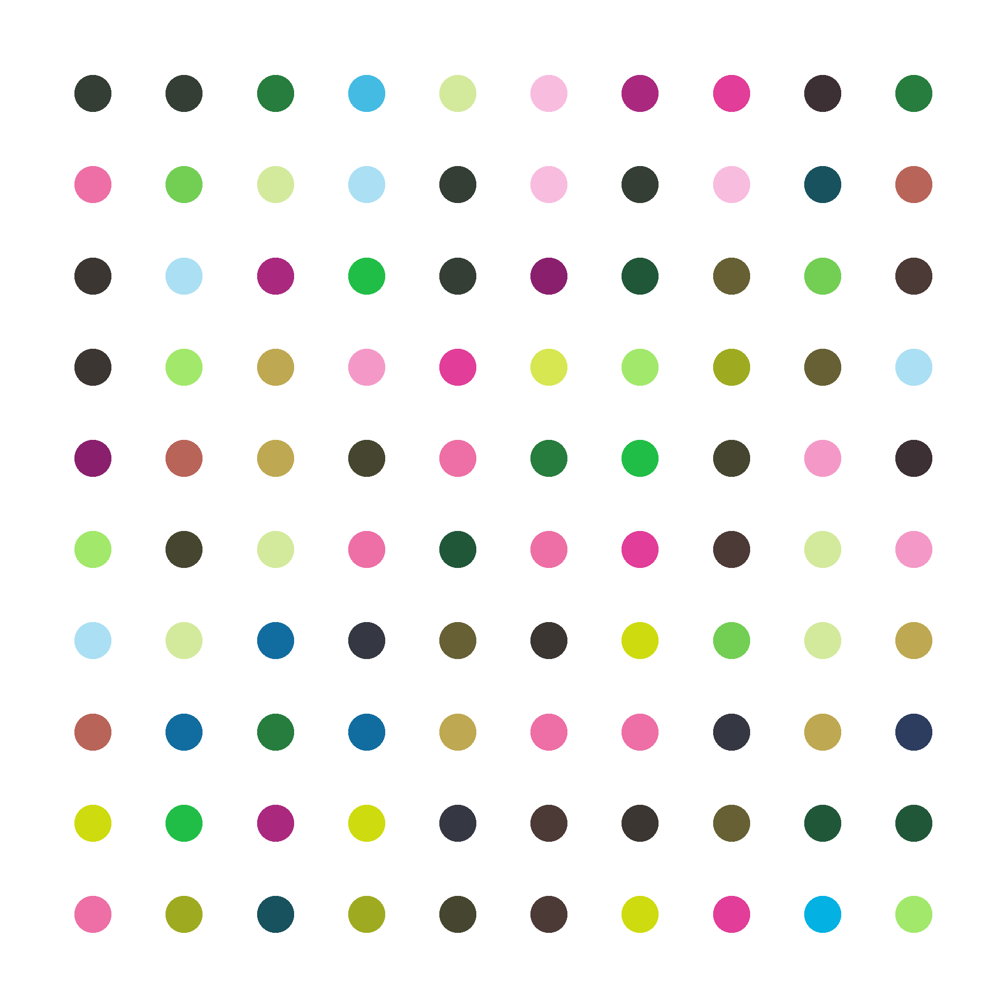

# Spot Painting Generator
## Spot Paintings
According to Wikipedia, Damien Steven Hirst is an English artist, entrepreneur, and art collector. He is reportedly the United Kingdom's richest living artist, with his wealth estimated at US$384 million in the 2020 Sunday Times Rich List. <br>
His "Spot Paintings" have been sold for up to 1.275.000 pounds (roughly 1.5M dollars). <br>


<br>

## What does the script do?
Well, as the name suggests, this simple Python script uses Python's turtle module to generate spot paintings like Damien's based on the palette of an image chosen by you, so you can also sell your works of art and become a millionaire. <br>
Here's an example of a spot painting generated by this script: </br>



<br>

## How to use it
Install the required modules: <br>
`pip install -r requirements.txt` <br>
You can run the script now: <br>
`python ./spot-painting-generator.py` <br>
After you pick an image, the spot painting will be generated and saved in results/

## Options
Type `python spot-painting-generator.py --help` to see the available options...
```
usage: Generate Hirst's Spot Paintings [-h] [-w] [-H] [-s] [-d] [-r]

options:
  -h, --help        show this help message and exit
  -w , --width      number of dots in width
  -H , --height     number of dots in height
  -s , --size       dot size
  -d , --distance   distance between each dot
  -r, --random      random colors
```

## Idea
This script was made as one of the activities proposed by [this Python course](https://www.udemy.com/course/100-days-of-code)